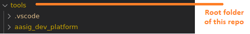

# AASIG Development Platform

----

## Table of content

- [AASIG Development Platform](#aasig-development-platform)
  - [Table of content](#table-of-content)
  - [About this repository](#about-this-repository)
  - [Language](#language)
  - [PAF](#paf)
  - [Quick start](#quick-start)
  - [Integration with 'VS Code'](#integration-with-vs-code)
  - [Configuration](#configuration)
    - [Configuration files](#configuration-files)
    - [Building AOSP parameters](#building-aosp-parameters)
    - [Cuttlefish emulator parameters](#cuttlefish-emulator-parameters)
    - [Build system parameters](#build-system-parameters)
    - [Goldfish emulator parameters](#goldfish-emulator-parameters)
    - [Docker parameters](#docker-parameters)
    - [CTS-specific parameters](#cts-specific-parameters)
    - [VTS-specific parameters](#vts-specific-parameters)
    - [QEMU-specific parameters](#qemu-specific-parameters)
    - [Images-specific parameters](#images-specific-parameters)
    - [LFS-specific parameters](#lfs-specific-parameters)
    - [XQVD-specific parameters](#xqvd-specific-parameters)
    - [Moulin-specific parameters](#moulin-specific-parameters)
  - [How to extend?](#how-to-extend)
  - [FAQ](#faq)

----

## About this repository

This repository contains an automation project, which allows to easily build the following components:

- Android Open Source Project (AOSP - https://source.android.com/)
- U-Boot (https://www.denx.de/wiki/U-Boot/)
- QEMU (https://www.qemu.org/)
- Linux kernel (https://kernel.org/)
- BusyBox (https://busybox.net/)
- BuildRoot (https://buildroot.org/)
- QEMU and Xen (https://www.qemu.org/ & https://xenproject.org/)

It will configure a set of the most frequently used parameters. Moreover, it supports automated preparation of execution of the AOSP on the goldfish and cuttlefish emulators.

The intention is to maintain this project and build more specific automation scenarios on top of it. Further extensions would support nuances of building AOSP for specific boards, which maintainers would be interested in.

## Language

As of now, we are using Python for the development of scenarios. Still, it is used in a specific way, meaning that the python code is firing a set of the bash one-liners. So, anyone who likes long bash commands also won't be disappointed :)

## PAF

The AASIG dev platform is implemented, using the PAF framework. That is an open-source GitHub project. It originates from [this location](https://github.com/svlad-90/paf).

Still, it is so tiny, that it was fully copied to this repo, under the '[paf](./paf)' folder. The full copy was made, as the original project might evolve separately. In the future that might cause incompatibility between the implemented automation scenarios of the AASIG project and the API of the framework. Thus, we've decided to stick to a certain version, and do manual updates of the framework, if ever needed.

To get an idea regarding the PAF framework, please, visit [this page](./paf/README.md)

## Quick start

To get started, one should do the following things:
- Clone this repo
- Open the terminal in the root folder
- Execute the following command:
  ```bash
  python ./paf/paf_main.py -imd ./build -c ./build/build_android/general_settings.xml -c ./build/devices/scenarios_covesa.xml -s build_android -ld="./"
  ```

The above major scenario will guide you through:
- downloading the repo tool
- [optional] injecting the local_manifest specified in the scenario
- init and sync of the repo from the specified branch
- build of AOSP

**Note!** The above scenario is not the only supported one. Check out the others [in the configuration file section](#configuration-files).

## Integration with 'VS Code'

The framework integrates into 'VS Code' through tasks that are defined in the `.vscode` folder. You can do it in the following way:
- Import the root folder of this repository inside the 'VS Code':

  

- Open the `.vscode/settings.json` file and adjust the following parameters according to your environment:
  |Parameter|Comment|
  |---|---|
  |`paf_location`|Leave as is. This parameter specifies the location of the PAF files which shall be used for the tasks|
  |`aasig_dev_platform_location`|Leave as is. Where to find the project-specific build rules (scenario and python files).|
  |`aosp_scenarios_xml_file`|Specify the target devices file. E.g. "devices/scenarios_xenvm_trout.xml" - base directory is `aasig_dev_platform_location`|
  |`cuttlefish_xml_file`|Leave as is. This parameter is only relevant for building and running cuttlefish environments |
  |`paf_logs_location`|Specify the **existing** folder where PAF will place its log files - leave it empty if no log files shall be created.|
  |`local_vendor_source_path`|In case you work with a specific AOSP repo, which you want to copy inside AOSP during the build, specify here the root folder of the dedicated copy of such repo.|
  |`local_vendor_destination_path`|In case you work with a specific AOSP repo, which you want to copy inside AOSP during the build, specify here the full path to the target folder inside the AOSP, e.g. "device/vendor/my_project"|
- Press "Ctrl + Shift + P", and select "Tasks: Run Task". Select one of the supported tasks:
  |Task name|Comment|
  |---|---|
  |build_android_full|(Repo-)sync and build AOSP.|
  |build_android|Build already synced AOSP.|
  |build_android_with_local_vendor|Copy the local folder into AOSP and build it.|
  |run_android_goldfish|Run Android using the goldfish emulator.|
  |cuttlefish_docker_install|Installs docker and prepares the system for using it.|
  |cuttlefish_deploy|Deploy cuttlefish project.|
  |cuttlefish_start_container|Start Android using the cuttlefish emulator.|
  |cuttlefish_stop_container|Stop running the instance of the Android cuttlefish.|
  |build_android_sdk|Build android SDK.|
  |build_android_sdk_with_local_vendor|Copy the local project into the AOSP and build the Android SDK.|
  |cts_execute_full|Sync Android, build CTS tests and execute them.|
  |cts_execute|Execute Android CTS tests.|
  |cts_execute_with_local_vendor|Copy the local project into the AOSP, build it with CTS, and execute the CTS test.|
  |vts_execute_full|Sync Android, build VTS tests and execute them.|
  |vts_execute|Execute VTS tests.|
  |vts_execute_with_local_vendor|Copy the local project into the AOSP, build it with VTS, and execute the VTS test.|
  |qemu_x86_build_images_and_run_android|Build the 'main' image and run x86 Android, using QEMU.|
  |qemu_x86_run_android|Run x86 Android, using QEMU.|
  |qemu_arm64_build_images_and_run_android|Build the 'main' image and run aarch64 Android, using QEMU.|
  |qemu_arm64_run_android|Run aarch64 Android, using QEMU.|
  |qemu_uboot_arm64_build_images_and_run_android|Build the 'main' image, which includes the 'boot' image. Boot image includes android boot image. Run aarch64 Android on QEMU, using u-boot. U-boot, Linux kernel, and buildroot should be previously built with 'lfs' tasks.|
  |qemu_uboot_arm64_run_android|Run aarch64 Android on QEMU, using u-boot & android boot image. U-boot, Linux kernel, and buildroot should be previously built with 'lfs' tasks.|
  |qemu_uboot_arm64_build_images_and_run_linux_abi|Build the 'main' image, which includes the 'boot' image. Boot image includes android boot image. Run aarch64 Linux on QEMU, using u-boot. U-boot, Linux kernel, and buildroot should be previously built with 'lfs' tasks.|
  |qemu_uboot_arm64_run_linux_abi|Run aarch64 Linux on QEMU, using u-boot. U-boot, Linux kernel, and buildroot should be previously built with 'lfs' tasks.|
  |qemu_uboot_arm64_build_images_and_run_linux_no_abi|Build the 'main' image, which includes the 'boot' image. No abi. Run aarch64 Linux on QEMU, using u-boot. U-boot, Linux kernel, and buildroot should be previously built with 'lfs' tasks.|
  |qemu_uboot_arm64_run_linux_no_abi|Run aarch64 Linux on QEMU, using u-boot. U-boot, Linux kernel, and buildroot should be previously built with 'lfs' tasks.|
  |qemu_system_prepare|Install qemu-related prerequisite packages, using 'apt'.|
  |lfs_u-boot_1_sync|Sync u-boot source code.|
  |lfs_u-boot_2_configure|Configure U-boot. Use [this](./paf/linux_deployment/doc/u-boot.txt) manual to an get idea of what to configure. Will reset previously configured parameters to the default ones for the selected architecture.|
  |lfs_u-boot_configure_edit|Configure U-boot without losing previously configured parameters.|
  |lfs_u-boot_3_build|Build u-boot.|
  |lfs_u-boot_4_deploy|Deploy u-boot artifacts to the target folder.|
  |lfs_u-boot_clean|Clean u-boot build.|
  |lfs_u-boot_remove|Remove all u-boot-related folders.|
  |lfs_u-boot_run|Run u-boot on QEMU.|
  |lfs_kernel_1_sync|Sync Linux kernel source code.|
  |lfs_kernel_2_configure|Configure Linux kernel. Use [this](./paf/linux_deployment/doc/kernel.txt) manual to get an idea of what to configure. Will reset previously configured parameters to the default ones for the selected architecture.|
  |lfs_kernel_configure_edit|Configure the build without losing previously configured parameters.|
  |lfs_kernel_3_build|Build Linux kernel.|
  |lfs_kernel_4_deploy|Deploy kernel artifacts to the target folder.|
  |lfs_kernel_clean|Clean kernel build.|
  |lfs_kernel_remove|Remove all kernel-related folders.|
  |lfs_kernel_run|Run Linux kernel, using QEMU. As it is started without rootfs and dtb, the kernel will certainly panic. This option was developed just for investigation purposes.|
  |lfs_busybox_1_sync|Sync busybox source code.|
  |lfs_busybox_2_configure|Configure busybox build. Use [this](./paf/linux_deployment/doc/busybox.txt) manual to get an idea of what to configure. Will reset previously configured parameters to the default ones for the selected architecture.|
  |lfs_busybox_configure_edit|Configure the build without losing previously configured parameters.|
  |lfs_busybox_3_build|Build busybox.|
  |lfs_busybox_4_deploy|Deploy busybox artifacts to the target folder.|
  |lfs_busybox_clean|Clean the busybox build.|
  |lfs_busybox_remove|Remove all busybox-related folders.|
  |lfs_busybox_run|Run kernel+busybox on QEMU. The kernel should be built separately using the other lfs tasks.|
  |lfs_buildroot_1_sync|Sync buildroot source-code.|
  |lfs_buildroot_2_configure|Configure the buildroot build. Use [this](./paf/linux_deployment/doc/buildroot.txt) manual to get an idea of what to configure. Will reset previously configured parameters to the default ones for the selected architecture.|
  |lfs_buildroot_configure_edit|Configure the build without losing previously configured parameters.|
  |lfs_buildroot_3_build|Build buildroot.|
  |lfs_buildroot_4_deploy|Deploy buildroot build artifacts to the target folder.|
  |lfs_buildroot_clean|Clean buildroot build.|
  |lfs_buildroot_remove|Remove all buildroot-related folders.|
  |lfs_buildroot_run|Run kernel+buildroot on QEMU. The kernel should be built separately using the lfs tasks.|
  |lfs_system_prepare|Installation of the required packages, using 'apt'.|
  |xqvd_1_docker_install|Installation of Docker in the context of the XQVD.|
  |xqvd_2_docker_build_image_for_xen_and_qemu|Build of the Docker image, which will be used to build Xen and QEMU inside of it.|
  |xqvd_3_clone_projects|Clone Xen and QEMU projects.|
  |xqvd_4_configure_xen|Configure Xen project.|
  |xqvd_5_build_xen|Build Xen project.|
  |xqvd_6_configure_qemu|Configure QEMU project.|
  |xqvd_7_build_qemu|Build QEMU project.|
  |xqvd_8_deploy_qemu_on_target|Deploy QEMU artifacts on the target device.|
  |xqvd_clean|Clean build folders of Xen and QEMU.|
  |xqvd_remove|Remove the project from the system. Will also remove all related XQVD Docker images and containers.|
  |xqvd_check_virtio_block_net_pci|Check the availability of the virtio network and block pci devices.|
  |xqvd_check_virtio_block_net_mmio|Check the availability of the virtio network and block mmio devices.|
  |xqvd_check_virtio_block_net_mmio_and_pci_combined|Check the availability of the virtio network mmio and block pci devices.|
  |xqvd_check_virtio_console_pci|Check the availability and operability of the virtconsole device.|
  |xqvd_deploy_evtest|Deploy 'evtest' package inside the DomU. The Docker image 'for_xen_and_qemu' should be already built.|
  |xqvd_check_virtio_input|Check the availability and operability of the virtio-keyboard-pci device. Relies on 'xqvd_deploy_evtest', as the scenario uses 'evtest' executable.|
  |xqvd_check_virtio_snd|Check the availability and the operability of the 'virtio-snd-pci' device.|
  |xqvd_check_snd|Check the operability of the sound device inside the DomD and DomU Xen domains.|
  |xqvd_check_virtio_gpu_pci|Check the availability of the 'virtio-gpu-gl-pci' device.|
  |xqvd_check_virtio_gpu_mmio|Check the availability of the 'virtio-gpu-gl' device.|
  |xqvd_reboot_board|Reboot the target board, which is running Xen.|
  |xqvd_reboot_board_from_emmc|Reboot the target board, which is running Xen, from the EMMC.|
  |xqvd_docker_start_container_xen_and_qemu|Start XQVD docker container for building Xen and QEMU. The Docker image 'for_xen_and_qemu' should be already built.|
  |xqvd_docker_build_image_for_kernel|Build of the Docker image, which will be used to build the kernel inside of it.|
  |xqvd_docker_start_container_kernel|Start XQVD docker container for building kernel. The Docker image 'for_kernel' should be already built.|
  |moulin_1_docker_install|Installation of Docker in the context of the moulin.|
  |moulin_2_docker_build_image|Build of the Docker image, which will be used for the subsequent moulin builds.|
  |moulin_3_clone_build_config|Clone the git repository, which contains the moulin build configuration.|
  |moulin_4_generate_ninja|Generate the ninja file, using the moulin build tool.|
  |moulin_5_build_project|Build the project, using the ninja tool.|
  |moulin_6_create_full_image|Create the full image for flashing the target device, using the 'rouge' tool.|
  |moulin_7_deploy_full_image_to_the_target|Deploy the full image on the target device, and boot from EMMC.|
  |moulin_nfs_and_tftp_deploy|Deploy build artifacts for the NFS and TFTP shares inside the 'deploy' moulin folder. This task should be called after the 'moulin_5_build_project'.|
  |moulin_nfs_and_tftp_upload_sw_to_the_rpi|Upload build artifacts to the NFS and TFTP locations inside the RPI. This task should be called after the 'moulin_nfs_and_tftp_deploy'.|
  |moulin_analyze_yocto_dependency|Find out which items do depend on the target dot graph node. Use it with the 'MOULIN_ANALYZE_YOCTO_DEPENDENCY_COMPONENT' and 'MOULIN_ANALYZE_YOCTO_DEPENDENCY_KEY' parameters.|
  |moulin_analyze_yocto_dependency_incremental|The same as the 'moulin_analyze_yocto_dependency', but without re-generating the dot graph.|
  |moulin_find_yocto_package_by_path|Find the package by the specified file path inside the target image. Use it with the 'MOULIN_FIND_YOCTO_PACKAGE_BY_IMAGE_PATH_COMPONENT' and 'MOULIN_FIND_YOCTO_PACKAGE_BY_IMAGE_PATH' parameters.|
  |moulin_generate_yocto_filtered_dot_graph|Open the dot graph, filtered by the target keyword with the 'xdot' tool. Use it with the 'MOULIN_FILTERED_DOT_GRAPH_BITBAKE_TARGET', 'MOULIN_DOT_GRAPH_YOCTO_COMPONENT', 'MOULIN_DOT_GRAPH_BITBAKE_PARAMETERS' and 'MOULIN_DOT_GRAPH_BITBAKE_TARGET' parameters.|
  |moulin_generate_yocto_filtered_dot_graph_incremental|The same as the 'moulin_generate_yocto_filtered_dot_graph', but without re-generating the dot graph.|
  |moulin_list_yocto_package_files|List files, which are provided by the specified package. Use it with the 'MOULIN_LIST_YOCTO_PACKAGE_FILES_COMPONENT' and 'MOULIN_LIST_YOCTO_PACKAGE_FILES' parameters.|
  |moulin_lookup_yocto_recipe_by_package|Find a recipe, which declared the specified package. Use it with the 'MOULIN_LOOKUP_YOCTO_RECIPE_BY_PACKAGE_COMPONENT' and 'MOULIN_LOOKUP_YOCTO_RECIPE_BY_PACKAGE' parameters.|
  |moulin_open_dot_dependency_graph_in_taskexp|Open the dot dependency graph with the 'taskexp' tool. Use it with 'MOULIN_DOT_GRAPH_YOCTO_COMPONENT', 'MOULIN_DOT_GRAPH_BITBAKE_PARAMETERS', and 'MOULIN_DOT_GRAPH_BITBAKE_TARGET' parameters.|
  |moulin_write_yocto_env_to_file|Open the file, containing the 'bitbake -e' output for the specified target. Use it with the 'MOULIN_WRITE_YOCTO_ENV_TO_FILE_COMPONENT' and 'MOULIN_WRITE_YOCTO_ENV_TO_FILE_TARGET' parameters.|
  |moulin_dev_rebuild_target|Rebuild specific target within the specified Yocto component.|
  |moulin_dev_upload_files_inject_copy_to_target_parameters|Copy specified files and directories to the RPI.|

You may find more about each 'VS Code' task's implementation details, by looking at the following places:

|Location|Comment|
|---|---|
|[tasks.json](../.vscode/tasks.json)|The 'VS Code' configuration file, which describes all available 'VS Code' tasks.|
|[scripts](../.vscode/scripts/)|Location of 'sh' scripts, which are used by the 'VS Code' tasks. From there you might get information regarding which PAF tasks, phases, and scenarios are used by each 'VS Code' task.|
|[PAF XML configuration files](#configuration-files)|Contain a declaration of the used parameters, and available PAF phases and scenarios. In case if 'sh' script is using 'PAF task', which is the smallest automation building block, then you will need to jump directly to the python source code, as each 'PAF task' is a Python class.|

## Configuration

### Configuration files

To get familiar with all supported parameters, and all declared scenarios, phases, and tasks you could check the following files:

|File|Commanet|
|---|---|
|[general_settings.xml](./build/build_android/general_settings.xml)|General configuration to build AOSP.|
|[scenarios_calculator.xml](./build/devices/scenarios_calculator.xml)|Build of the AOSP with the injected "calculator" HIDL and AIDL implementation.|
|[scenarios_ces_demo_2022.xml](./build/devices/scenarios_ces_demo_2022.xml)|Build of the demo-ces-2022 simulation.|
|[scenarios_covesa.xml](./build/devices/scenarios_covesa.xml)|Build of the AOSP.|
|[scenarios_cuttlefish.xml](./build/devices/scenarios_cuttlefish.xml)|Build of the AOSP version, which proved to work using the 'cuttlefish' emulator.|
|[scenarios_some_ip.xml](./build/devices/scenarios_some_ip.xml)|Build of the AOSP with the injected SOME/IP VHAL implementation.|
|[scenarios_trout.xml](./build/devices/scenarios_trout.xml)|Build of the AOSP x86 'trout' device.|
|[scenarios_xenvm_trout.xml](./build/devices/scenarios_xenvm_trout.xml)|Build the AOSP with the injected extended 'trout' device, which is capable of running on QEMU.|
|[scenarios.xml](./paf/linux_deployment/scenarios.xml)|'Linux from scratch' configuration.|
|[cuttlefish.xml](./build/cuttlefish/cuttlefish.xml)|Running cuttlefish emulator.|
|[images.xml](./build/images/images.xml)|Building main image, boot image, etc.|
|[cts.xml](./build/cts/cts.xml)|Execution of the CTS test.|
|[vts.xml](./build/vts/vts.xml)|Execution of the VTS test.|
|[qemu.xml](./build/qemu/qemu.xml)|General configuration to run AOSP on QEMU.|
|[qemu_arm64.xml](./build/qemu/qemu_arm64.xml)|Specific configuration to run aarch64 AOSP on QEMU. Should be used together with 'qemu.xml'.|
|[qemu_x86.xml](./build/qemu/qemu_x86.xml)|Specific configuration to run x86 AOSP on QEMU. Should be used together with 'qemu.xml'.|
|[qemu_uboot_arm64.xml](./build/qemu/qemu_uboot_arm64.xml)|Specific configuration to run aarch64 AOSP on QEMU, using u-boot. Should be used together with 'qemu.xml'.|
|[xen_qemu_virtio_development.xml](./build/xen_qemu_virtio_development/xen_qemu_virtio_development.xml)|Specific configuration, used for the QEMU development for Xen.|
|[moulin.xml](./build/moulin/moulin.xml)|Specific configuration, used for building projects using 'moulin' and 'rouge' tools.|

Still, as we love proper documentation, here is the full list of supported parameters with comments.

### Building AOSP parameters

|Parameter|Comment|
|---|---|
|ROOT|Root folder of the project. All the other things will be placed inside this folder. Note! Try to place the root folder near the "/" root. There were cases when the too-deeply nested ROOT folder caused build failure due to the too-long argument lists, fired by the ninja tool.|
|ANDROID_DEPLOYMENT_DIR|This is a project's dir. Will be located inside ROOT.|
|DOWNLOAD_DIR|The directory is used to download the binary artifacts. E.g. repo tool. Located inside the ROOT/ANDROID_DEPLOYMENT_DIR.|
|SOURCE_DIR|The directory is used to clone git repositories in it. E.g. AOSP sources or cuttlefish git repo. Located inside the ROOT/ANDROID_DEPLOYMENT_DIR.|
|BUILD_DIR|The directory, which we try to use as a build folder. E.g. AOSP build process would be ongoing inside that folder's sub-folder. Located inside the ROOT/ANDROID_DEPLOYMENT_DIR.|
|DEPLOY_DIR|Used to collect target-built artifacts there. Located inside the ROOT/ANDROID_DEPLOYMENT_DIR.|
|REPO_TOOL_SUB_DIR|Sub-directory, in which the repo tool will be downloaded. Located inside the ROOT/ANDROID_DEPLOYMENT_DIR/DOWNLOAD_DIR.|
|ANDROID_REPO_URL|Link to a git repository that contains the Android platform manifest.|
|ANDROID_REPO_BRANCH|Branch, which we will sync.|
|ANDROID_LUNCH_CONFIG|Lunch configuration, which will be used during the build and execution of the goldfish emulator.|
|ANDROID_MANIFEST|Link to the Android manifest.|
|ANDROID_LOCAL_MANIFESTS_GIT_URL|Link to the git repository, which contains the local manifest, which we want to inject into the build.|
|ANDROID_LOCAL_MANIFESTS_GIT_BRANCH|The branch of the local manifest repository, which should be used. If not specified - then the default branch will be used.|
|LOCAL_VENDOR_SOURCE_PATH|If you work with some local project, you can inject it into the AOSP build without the usage of the ANDROID_LOCAL_MANIFESTS_GIT_URL parameter. To do this, you will need to remove the usage of the ANDROID_LOCAL_MANIFESTS_GIT_URL. Then you'll need to specify the LOCAL_VENDOR_DESTINATION_PATH and the LOCAL_VENDOR_SOURCE_PATH parameters. The LOCAL_VENDOR_SOURCE_PATH should contain the path to your local vendor folder, which contains some buildable artifacts. Can be used to locally inject the folder into the AOSP build.|
|LOCAL_VENDOR_DESTINATION_PATH|The path inside the AOSP source folder, where you would like to locate your artifacts. It will be used to copy the content of the LOCAL_VENDOR_SOURCE_PATH folder inside the ANDROID_SOOURCE_ROOT / LOCAL_VENDOR_DESTINATION_PATH before the build. Be aware that if this option is used, it will cause the removal and copying of the directory on each build iteration.|\
|LOCAL_VENDOR_COPY_NEWER_FILES|Copy only newer files from the local vendor folder. If used with knowledge, might speed up the build, as fewer files would be copied.|
|PATCH_AFTER_REPO_SYNC_HOOK|Can contain bash-like CLI command, which will be executed during the build, **AFTER THE "repo sync" COMMAND**. It can be used to patch some of the AOSP files.|
|IS_SDK_BUILD|Whether the build includes the 'sdk' target. If it is equal to "True" - PATCH_AFTER_REPO_SYNC_HOOK_SDK hook will be executed.|
|PATCH_AFTER_REPO_SYNC_HOOK_SDK|Can contain bash-like CLI command, which will be executed during the build, **AFTER THE "repo sync" COMMAND in case IS_SDK_BUILD is equal to "True"**. It can be used to patch some of the AOSP files.|
|MAKE_TARGET|Specifies the target to be built|

### Cuttlefish emulator parameters

|Parameter|Comment|
|---|---|
|CUTTLEFISH_SUB_DIR|Sub-directory, into which the cuttlefish project would be synced. Located inside ROOT/ANDROID_DEPLOYMENT_DIR\SOURCE_DIR.|
|CUTTLEFISH_GIT_URL|Link to the cuttlefish git repository.|
|ANDROID_PRODUCT_OUT|Path to the Android product output directory.|
|ANDROID_HOST_OUT|Path to the Android host output directory.|
|CUTTLEFISH_DOCKER_CONTAINER_NAME|Name of the cuttlefish docker container, which will be created.|
|CUTTLEFISH_PARAMS|The string with parameters, which would be directly passed to the cuttlefish emulator.|
|CUTTLEFISH_COMMIT_ID|Specifies which commit id to use to build cuttlefish. Optional parameter. If not specified, then the HEAD of the 'CUTTLEFISH_GIT_URL' repo is used|

### Build system parameters

|Parameter|Comment|
|---|---|
|BUILD_SYSTEM_CORES_NUMBER|Number of the simultaneous tasks, which you want to run in parallel during repo init, repo sync, make, etc.|
|REPO_INIT_DEPTH|Specifies the "--depth" parameter during the "repo init" call. Creates a shallow clone with a given depth. See "git clone" for more details.|
|REPO_SYNC_THREADS_NUMBER|Specifies the "-j" parameter during the "repo sync" call. The number of jobs to run in parallel.|
|REPO_TRACE|Specifies the "--trace" option during the "repo" calls. Trace git command execution (REPO_TRACE=1).|
|REPO_SYNC_CURRENT_BRANCH|Specifies the "--current-branch" parameter during the "repo sync" call. Specifies whether to fetch only the current branch from the server.|
|REPO_SYNC_FORCE|Specifies the "--force-sync" parameter during the "repo sync" call. Overwrites an existing git directory if it needs to point to a different object directory. **WARNING: This may cause loss of data.**|

### Goldfish emulator parameters

|Parameter|Comment|
|---|---|
|WIPE_DATA|Whether to run the emulator from scratch or to continue from the previous suspension point.|
|NET|Whether to establish the bridge between the running emulator and the host system.|

### Docker parameters

|Parameter|Comment|
|---|---|
|DOCKER_GPG_KEY_URL|Parameter is used to add the docker's stable repository.|
|DOCKERFILE_PATH|Path to the Dockerfile, from which the docker image is created.|
|DOCKER_IMAGE_NAME|Target docker image name. It is used to create a target image.|
|DOCKER_CONTAINER_NAME|Target docker container name. Used for the creation, removal, stop, and start of the docker container.|
|DOCKER_MOUNT_FOLDER|The folder, which should be mounted to the created docker container.|
|DOCKER_CREATE_ADDITIONAL_PARAMS|Specifies additional parameters, which will be used during the 'docker create' call. Optional parameter.|
|DOCKER_SSH_MOUNT_FOLDER|Specifies the folder with the SSH artifacts ( keys, other config files ), which will be used inside the Docker container.|
|DOCKER_GIT_CONFIG_MOUNT_FOLDER|Specifies the folder with the configuration, which will be used inside the Docker container.|


### CTS-specific parameters

|Parameter|Comment|
|---|---|
|CTS_ARCHIVE_NAME|Name of the archive with extension from the CTS_DOWNLOAD_LINK. E.g. android-cts-12.1_r1-linux_x86-x86.zip|
|CTS_DOWNLOAD_LINK|URL, from which we should download the CTS build. E.g. https://dl.google.com/dl/android/cts/android-cts-12.1_r1-linux_x86-x86.zip|
|CTS_SUBDIR|The sub-directory name, into which will be placed downloaded and unpacked CTS artifacts.|
|CTS_MODULE|Specifies which CTS module to execute. If this parameter is not mentioned, then the default 'cts' plan will be executed.|

### VTS-specific parameters

|Parameter|Comment|
|---|---|
|VTS_MODULE|Specifies which VTS module to execute. If this parameter is not mentioned, then the default 'vts' plan will be executed.|

### QEMU-specific parameters

A set of parameters, that is related to running the AOSP trout device on the QEMU. Theoretically, it can be re-used to run any cuttlefish-based device on the QEMU. For supported scenarios and used parameters refer to the [qemu.xml](./build/qemu/qemu.xml), [qemu_x86.xml](./build/qemu/qemu_x86.xml), and [qemu_arm64.xml](./build/qemu/qemu_arm64.xml)

|Parameter|Comment|
|---|---|
|QEMU_PATH|Folder, in which QEMU binaries are located. If not specified, the default patched QEMU will be used, which is deployed during the qemu_system_prepare task.|
|QEMU_ARCH|Specifies which architecture we are running on. Was tested on x86(_64) and arm64.|
|TARGET_DEVICE|Name of the target device. Should be equal to the name of the 'build_folder/target/product/>>device_name<<' folder.|
|KERNEL_CMDLINE|Kernel CMD line, which is passed to the running system.|
|ANDROID_KERNEL_CMDLINE|Android-specific CMD line, which is passed to the running system. Separated as a dedicated parameter, as in the case of running with u-boot and Android boot image, these parameters are placed inside the bootconfig within the ramdisk.|
|RUN_QEMU|QEMU execution parameters.|

### Images-specific parameters

|Parameter|Comment|
|---|---|
|FS_DECLARATION_XYZ|Declares file-system partition, which should be placed into the 'main.img', which is used to run QEMU. Replace 'XYZ' with any suitable name. E.g. SUPER, USERDATA, CACHE, METADATA, MISC, VBMETA, VBMETA_SYSTEM, BOOT, etc. The expected value is one of the following ones - 'fs_from_image', 'fs_empty', or 'fs_zeroed'. fs_from_image - file-system in the main image will be created out of the image file located in the Android 'out' folder. fs_empty - empty file-system of the 'FS_XYZ_SIZE_MB' size will be created. fs_zeroed - file-system of the 'FS_XYZ_SIZE_MB' size filled in with zeroes will be created.|
|FS_BOOT_IMAGE_PATH|Path to the image. Should be used only if you want to use a specific image, which is located outside the AOSP 'target' folder. Replace 'XYZ' with the file-system name, used in FS_DECLARATION_XYZ.|
|FS_XYZ_NAME|Name of the image, located in the Android 'out' folder. Without '.img' extension. Case sensitive. E.g. super, userdata, etc. Replace 'XYZ' with the file-system name, used in FS_DECLARATION_XYZ.|
|FS_XYZ_TYPE|Type of the used file system. Passed to the 'parted' tool. Usually, 'ext4' is used. Replace 'XYZ' with the file-system name, used in FS_DECLARATION_XYZ.|
|FS_XYZ_MOUNT_PATH|Mount-path of the file system inside the Android. Passed to parted. E.g. super,userdata, vbmeta_a, vbmeta_system_a, etc. Replace 'XYZ' with the file-system name, used in FS_DECLARATION_XYZ.|
|FS_XYZ_SIZE_MB|Size of the file system. Used mainly for file-system of 'fs_empty' and 'fs_zeroed' types. For 'fs_from_image' expected to be omitted, as in such a case the size is calculated automatically from the source image. Replace 'XYZ' with the file-system name, used in FS_DECLARATION_XYZ.|
|FS_BOOT_IS_BOOTABLE|Tells whether the partition is bootable. Expected values are "True" or "False".|
|IMAGES_BUILD_BOOT_IMAGE|Specifies, whether the script will build the boot image. Expects boolean values "True" or "False".|
|IMAGES_UBOOT_MKIMAGE_PATH|Path to the u-boot mkimage tool, which is used to pack the files into the boot image for the non-android-boot-image mode.|
|IMAGES_KERNEL_BOOTCONFIG_PATH|Path to the bootconfig tool, which is usually located inside the kernel build folder. Used to attach bootconfig to the ramdisk in case if running with an android boot image.|
|IMAGES_BOOT_SCR_PATH|Path to the boot.scr u-boot script, which will be used to run the system, in case 'u-boot' QEMU_EXECUTION_MODE is used.|
|IMAGES_DTB_PATH|Path to the device tree, which is packed into the boot image.|
|IMAGES_BOOT_IMAGE_TYPE|Specifies, which boot image type is used to build the boot image and to run the system. Depending on the value, will try to find and parse other image-specific parameters. E.g. IMAGES_XYZ_SIZE_MB, IMAGES_XYZ_RAMDISK_PATH, IMAGES_XYZ_USE_ABI, etc.|
|IMAGES_XYZ_SIZE_MB|The size of the boot image. Not calculated automatically, so pass here the value, which would be enough. Usually, 256 Mb is sufficient. Replace 'XYZ' with the value you've provided into the 'IMAGES_BOOT_IMAGE_TYPE' parameter.|
|IMAGES_XYZ_RAMDISK_PATH|Path to the ramdisk, which is placed inside the boot image. Replace 'XYZ' with the value you've provided into the 'IMAGES_BOOT_IMAGE_TYPE' parameter.|
|IMAGES_XYZ_KERNEL_PATH|Path to the kernel, which is placed inside the boot image. Replace 'XYZ' with the value you've provided into the 'IMAGES_BOOT_IMAGE_TYPE' parameter.|
|IMAGES_XYZ_USE_ABI|Specifies whether we are using android-boot-image or not. Depending on this parameter the boot image will be filled in in a specific way.|
|QEMU_BIOS_PATH|Path to the loader ( e.g. u-boot ) which is passed to QEMU as a '-bios' parameter, in case 'u-boot' QEMU_EXECUTION_MODE is used. Replace 'XYZ' with the value you've provided into the 'IMAGES_BOOT_IMAGE_TYPE' parameter.|

### LFS-specific parameters

LFS parameters described [here](./paf/linux_deployment/README.md#configuration)

### XQVD-specific parameters

The section describes Xen QEMU virtio development parameters.

**Note!** Some of the below parameters may collide with parameters from the other automation domains. As this automation is intended to be used separately from the Android development - it is a normal situation.

|Parameter|Comment|
|---|---|
|ROOT|Root folder of the project. All the other things will be placed inside this folder.|
|XQVD_DEPLOYMENT_DIR|This is a project's dir. Will be located inside ROOT.|
|DOWNLOAD_DIR|The directory is used to download the binary artifacts. Located inside the ROOT/XQVD_DEPLOYMENT_DIR.|
|SOURCE_DIR|The directory is used to clone git repositories in it. Located inside the ROOT/XQVD_DEPLOYMENT_DIR.|
|BUILD_DIR|The directory, which we try to use as a build folder. Located inside the ROOT/XQVD_DEPLOYMENT_DIR.|
|DEPLOY_DIR|Used to collect target-built artifacts there. Located inside the ROOT/XQVD_DEPLOYMENT_DIR.|
|BRANCH_DIR|The directory is used to differentiate between the multiple instances of the project. Located inside the DOWNLOAD_DIR, SOURCE_DIR, BUILD_DIR, DEPLOY_DIR. Also, this name is used as the XQVD docker container tag. And as part of the created XQVD docker image name.|
|XEN_GIT_URL|URL to the git repository, from which the Xen project should be cloned.|
|XEN_GIT_BRANCH|Name of the git branch, which should be used during the clone operation.|
|QEMU_GIT_URL|URL to the git repository, from which the QEMU project should be cloned.|
|QEMU_GIT_BRANCH|Name of the git branch, which should be used during the clone operation.|
|XQVD_DOCKER_IMAGE_NAME|The name of the XQVD docker image. Will be combined with the BRANCH_DIR as "${XQVD_DOCKER_IMAGE_NAME}:${BRANCH_DIR}".|
|XQVD_DOCKER_CONTAINER_NAME|The name of the XQVD docker container. Will be combined with the BRANCH_DIR as "${XQVD_DOCKER_IMAGE_NAME}_${BRANCH_DIR}".|
|BUILD_SYSTEM_CORES_NUMBER|The number of threads, which will be used to build the projects.|
|RPI_IP_ADDRESS|The RPI IP address or the hostname.|
|RPI_USER_NAME|The username, which should be used for connection to the RPI over SSH.|
|RPI_SSH_KEY_NAME|The ssh key name, which will be generated by the script to be installed on the RPI and Xen domains.|
|RPI_MINICOM_USB|The minicom USB device location, which allows communication with the Dom0.|
|RPI_NFS_YOCTO_ROOT|The share point between the RPI and the target device, loaded from the Yocto image.|
|RPI_TFTP_DOM0_ROOT|Root directory, into which to deploy Dom0 TFTP artifacts.|
|RPI_TFTP_XEN_ROOT|Root directory, into which to deploy Xen TFTP artifacts.|
|RPI_NFS_DOMD_ROOT|Root directory, into which to deploy DomD NFS artifacts.|
|RPI_DOM0_NAME|The Dom0 name.|
|RPI_DOM0_USERNAME|The username, which should be used to communicate with Dom0 over the minicom.|
|RPI_DOMD_NAME|The DomD name.|
|RPI_DOMD_CONSOLE_NAME|The name of the target machine, which is presented in the console of the device. E.g. 'h3ulcb-4x2g-kf-xt-domd'. Used to automate communication with the Xen domain over the minicom.|
|RPI_DOMD_USERNAME|The DomD username, which should be used to communicate with the DomD.|
|RPI_DOMD_PASSWORD|The DomD password, which should be used to communicate with the DomD.|
|RPI_DOMU_NAME|The DomU name.|
|RPI_DOMU_CONSOLE_NAME|The name of the target machine, which is presented in the console of the device. E.g. 'h3ulcb-4x2g-kf-xt-domu'. Used to automate communication with the Xen domain over the minicom.|
|RPI_DOMU_USERNAME|The DomU username, which should be used to communicate with the DomD.|
|RPI_DOMU_PASSWORD|The DomU password, which should be used to communicate with the DomD.|
|XQVD_COPY_TO_RPI_BEFORE_COPY_HOOK|Used with the 'xqvd_copy_file_to_the_rpi' PAF task. Something to be done in the context of the RPI before the copy operation was started.|
|XQVD_COPY_TO_RPI_SOURCE|Used with the 'xqvd_copy_file_to_the_rpi' PAF task. Tells from where to copy the file to the rpi.|
|XQVD_COPY_TO_RPI_DESTINATION|Used with the 'xqvd_copy_file_to_the_rpi' PAF task. Tells where to place the file on the rpi.|
|XQVD_COPY_TO_RPI_AFTER_COPY_HOOK|Used with the 'xqvd_copy_file_to_the_rpi' PAF task. Something to be done in the context of the RPI after the file was successfully copied.|
|RPI_DOMU_SSH_PORT|port, which is configured to forward the SSH communication from DomD to Domu|
|RPI_YOCTO_CONSOLE_NAME|The name of the target machine, which is presented in the console of the device. E.g. 'h3ulcb'. Used to automate communication with the target system over the minicom, when boot from yocto.|
|RPI_YOCTO_USERNAME|The username, which should be used to communicate with the system when boot from yocto.|
|RPI_YOCTO_PASSWORD|The password, which should be used to communicate with the system when boot from yocto.|

### Moulin-specific parameters

The section describes moulin-specific parameters.

|Parameter|Comment|
|---|---|
|MOULIN_ROOT|Root folder of the project. All the other things will be placed inside this folder.|
|MOULIN_DEPLOYMENT_DIR|This is a 'moulin' automation layer dir. Will be located inside the ROOT.|
|MOULIN_DOWNLOAD_DIR|This directory is used to download the binary artifacts. Located inside the ROOT/MOULIN_DEPLOYMENT_DIR.|
|MOULIN_SOURCE_DIR|This directory is used to clone git repositories in it. Located inside the ROOT/MOULIN_DEPLOYMENT_DIR.|
|MOULIN_BUILD_DIR|This directory, which we try to use as a build folder. Located inside the ROOT/MOULIN_DEPLOYMENT_DIR.|
|MOULIN_DEPLOY_DIR|Used to collect target-built artifacts there. Located inside the ROOT/MOULIN_DEPLOYMENT_DIR.|
|MOULIN_PRODUCT_GIT_URL|URL of the git repository, from where the build configuration should be cloned.|
|MOULIN_PRODUCT_GIT_BRANCH|Name of the git branch, which should be used during the clone operation.|
|MOULIN_PRODUCT_GIT_COMMIT|Target commit id, which will be used for the build. It is an optional parameter.|
|MOULIN_BUILD_CONFIGURATION_FILE_NAME|The name of the 'moulin' build configuration file, which should be used for the build.|
|MOULIN_BUILD_CONFIGURATION_FILE_EXTENSION|The extension of the build configuration file. Usually *.yaml.|
|MOULIN_MACHINE|The machine type to be used for the build.|
|MOULIN_ADDITIONAL_PARAMETERS|Additional parameters to be added to the 'moulin' and 'rouge' calls.|
|MOULIN_DOT_GRAPH_YOCTO_COMPONENT|Moulin component of yocto type, for which you want to select targets for the graph generation.|
|MOULIN_DOT_GRAPH_BITBAKE_PARAMETERS|Parameters for running bitbake to generate the dependency graph.|
|MOULIN_DOT_GRAPH_BITBAKE_TARGET|Target, for which we want to generate a graph.|
|MOULIN_FILTERED_DOT_GRAPH_BITBAKE_TARGET|Target, for which we want to filter the original dot graph.|
|MOULIN_ANALYZE_YOCTO_DEPENDENCY_COMPONENT|The moulin component, with which we want to work for this operation.|
|MOULIN_ANALYZE_YOCTO_DEPENDENCY_KEY|The dependency name, which we want to analyze.|
|MOULIN_WRITE_YOCTO_ENV_TO_FILE_COMPONENT|The moulin component, with which we want to work for this operation.|
|MOULIN_WRITE_YOCTO_ENV_TO_FILE_TARGET|The target, for which we want to generate the environment file.|
|MOULIN_FIND_YOCTO_PACKAGE_BY_IMAGE_PATH_COMPONENT|The moulin component, with which we want to work for this operation.|
|MOULIN_FIND_YOCTO_PACKAGE_BY_IMAGE_PATH|File path inside the target image, for which we want to find owning package.|
|MOULIN_LOOKUP_YOCTO_RECIPE_BY_PACKAGE_COMPONENT|The moulin component, with which we want to work for this operation.
|MOULIN_LOOKUP_YOCTO_RECIPE_BY_PACKAGE|Package name, for which we want to find the owning recipe.|
|MOULIN_LIST_YOCTO_PACKAGE_FILES_COMPONENT|The moulin component, with which we want to work for this operation.|
|MOULIN_LIST_YOCTO_PACKAGE_FILES|Package, for which we want to list the containing files.|
|MOULIN_DOCKER_IMAGE_NAME|The name of the docker image, which will be created during the automation steps. This value will be combined with the other pieces.|
|MOULIN_DOCKER_CONTAINER_NAME|The name of the docker container, which will be created during the automation steps. This value will be combined with the other pieces.|
|MOULIN_DEV_REBUILD_TARGET_YOCTO_COMPONENT|In which Yocto component to rebuild the target? Should be used with 'moulin_dev_rebuild_target' task.|
|MOULIN_DEV_REBUILD_TARGET|Which target to rebuild? Should be used with 'moulin_dev_rebuild_target' task.|
|MOULIN_DEV_REBUILD_IMAGE|Which image to rebuild? Usually, it should be the image, which contains the rebuild target. Should be used with 'moulin_dev_rebuild_target' task.|
|MOULIN_UPLOAD_FILES_SOURCE|Semicolon-separated list of the paths, which can be both files and directories. All paths should be relative to the moulin build directory. Should be used with the  'moulin_dev_upload_files_inject_copy_to_target_parameters' task.|
|MOULIN_UPLOAD_FILES_DESTINATION|Destination folder on the RPI, where all the files should be placed. Should be used with the 'moulin_dev_upload_files_inject_copy_to_target_parameters' task.|

##  How to extend?

If you want to introduce a new automation task, you'll need to extend the following parts of the project:

- Implement a new 'PAF task' in the python code, anywhere inside the [build](./build) folder. You may add new *.py files. They will be injected into the execution environment automatically.
- Optionally, extend the PAF XML configuration with the declaration of the new parameters, scenarios, and phases. An example is any XML file, mentioned [here](#configuration-files).
- Add new *.sh script [here](../.vscode/scripts). Inside the script run PAF with a specific scenario, mentioning all required configuration XML files. Do not forget to assign an execution bit to the script, so that it is allowed to be executed as a program.
- Link script to the 'VS Code' IDE [here](../.vscode/tasks.json).

## FAQ

**Q: How to fill in ANDROID_PRODUCT_OUT parameter?**

**A:** You need to do the following things:

- Go to https://ci.android.com/.
- Select any specific aosp_cf_x86_64_phone artifact build and download the following artifact:
  aosp_cf_x86_64_phone-img-XYZXYZx.zip
- Place aosp_cf_x86_64_phone-img-XYZXYZx.zip into any folder, unpack it, and specify it as the ANDROID_PRODUCT_OUT

Unfortunately, it is quite hard to automate this download. So, currently, it is a TODO task.

As an alternative, you can specify the folder of the manually built AOSP:
```
ANDROID_PRODUCT_OUT=/android_source_root_folder/out/target/product/vsoc_x86
```

**Q: How to fill in ANDROID_HOST_OUT parameter?**

**A:** You need to do the following things:

- Go to https://ci.android.com/.
- Select any specific aosp_cf_x86_64_phone artifact build and download the following artifact:
  cvd-host_package.tar.gz
- Place cvd-host_package.tar.gz in any folder and specify it as the ANDROID_HOST_OUT, without unpacking the archive.

Unfortunately, it is quite hard to automate this download. So, currently, it is a TODO task.

As an alternative, you can specify the folders of the manually built AOSP:
```
ANDROID_HOST_OUT=/android_source_root_folder/soong/host/linux-x86
```

**Q: Why some of the automation scenarios do contain the usage of the "apt" tool? Does this repository cover only DPKG-based Linux distributions?**

**A:** Yes. As of now, implemented scenarios are compatible only with the DPKG-based Linux distributions. Still, it'll require a minor effort to support any other type of distribution. Thus, fill free to contribute.
